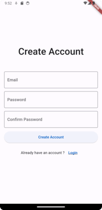
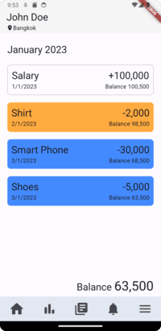

# Expense Tracker Flutter Application 


## Screenshot




## Data Foramt
```json
{
  "month": 1,
  "year": 2023,
  "remaining_balance": 500,
  "transactions": [
    {
      "id": "1",
      "sequence": 1,
      "description": "Salary",
      "amount": 100000,
      "date": "1/1/2023",
      "type": "income",
      "category": "",
      "color": ""
    },
    {
      "id": "2",
      "sequence": 2,
      "description": "Shirt",
      "amount": 2000,
      "date": "2/1/2023",
      "type": "expense",
      "category": "online",
      "color": "orange"
    },
    {
      "id": "3",
      "sequence": 3,
      "description": "Smart Phone",
      "amount": 30000,
      "date": "3/1/2023",
      "type": "expense",
      "category": "credit card",
      "color": "blue"
    },
    {
      "id": "4",
      "sequence": 4,
      "description": "Shoes",
      "amount": 5000,
      "date": "3/1/2023",
      "type": "expense",
      "category": "credit card",
      "color": "blue"
    }
  ]
}

```